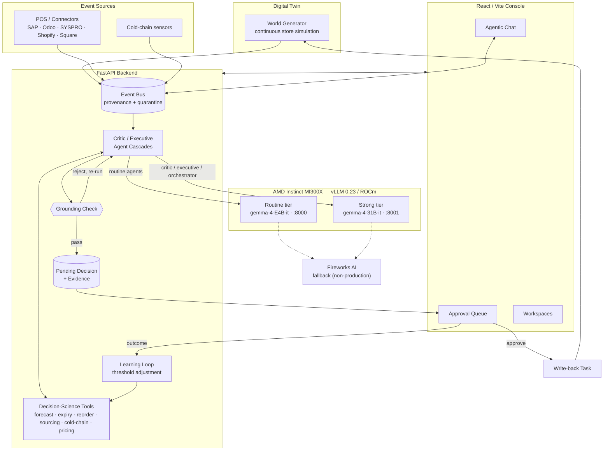

# ShelfWise

[](https://github.com/mrlucas679/shelfwise/actions/workflows/ci.yml)
[](https://github.com/mrlucas679/shelfwise/actions/workflows/capability-diff.yml)
[](LICENSE)
[](pyproject.toml)
[](#built-on-amd-compute-usage-proof)

**Agentic AI store operations, grounded in real math — built on AMD Instinct MI300X.**

AMD Developer Hackathon ACT II · Track 3: Unicorn (Open Innovation).


ShelfWise runs a supermarket's interlocking daily decisions — expiry markdowns, procurement
and multi-source stock sourcing, till-price integrity, cold-chain response, recall quarantine,
and inventory exceptions — through real Critic/Executive agent pairs using a dual Gemma 4
topology: routine **google/gemma-4-E4B-it** and strong **google/gemma-4-31B-it** served on
separate AMD Instinct MI300X vLLM 0.23 (ROCm) tiers. Agents reason through a bounded tool-calling
loop over read-only platform tools, and every
recommendation lands as a pending decision that a human must approve before any write-back
happens.

`event -> agents (Gemma on MI300X) -> tools -> evidence -> critic -> executive -> HITL -> learning`

## Table of Contents

- [Highlights](#highlights)
- [Built on AMD (compute-usage proof)](#built-on-amd-compute-usage-proof)
- [Architecture](#architecture)
- [Security](#security)
- [Tech Stack](#tech-stack)
- [Getting Started](#getting-started)
- [Usage](#usage)
- [Testing](#testing)
- [API Reference](#api-reference)
- [Demo & Evidence](#demo--evidence)
- [Deployment](#deployment)
- [Project Structure](#project-structure)
- [Current Scope](#current-scope)
- [Inference Strategy](#inference-strategy)
- [Model Training](#model-training)
- [Contributing](#contributing)
- [License](#license)

## Highlights

- **Grounded reasoning, enforced in code.** A final agent answer must cite the numbers its
  tools actually computed. An answer citing a figure no tool produced is rejected and re-run
  (`assert_conclusion_grounded_in_tool_results`), never shipped — the model uses tools as its
  calculator and cannot invent figures.
- **Agentic chat over the whole store.** One question can trigger multiple live tool calls in
  a single turn (stock, forecasts, deliveries, sourcing, approvals), with structured markdown
  answers, multi-user conversation identity, and server-side tenant isolation.
- **Real multi-source sourcing decisions.** A shortage is never answered with a bare
  "transfer stock": candidate branches, distribution centres, and suppliers are ranked by
  availability, distance, and lead time, the winner is explained, and a purchase order is
  recommended for anything the winner cannot cover.
- **Human-in-the-loop by construction.** Every recommendation is a pending decision with
  evidence attached; nothing writes back without explicit approval, and approvals feed a
  learning loop that adjusts thresholds from real outcomes.
- **Governed exception workflows.** Recall quarantine, returns, damage, shrink investigation,
  and misplaced-stock relocation each carry required evidence, distinct actions, Critic
  review, and HITL — runnable as generated-world drills from the Operations workspace.
- **Receipts, not promises.** A 15-minute live soak harness, committed run artifacts, a
  machine-verified capability manifest that fails CI on drift, and honest evidence reports
  that separate measured behavior from configured behavior.

## Built on AMD (compute-usage proof)

- All agent reasoning — the four agentic cascades (`POST /demo/{golden,procurement,sales,cold-chain}/agentic`)
  and the agentic `/chat` — executes on an **AMD Instinct MI300X** droplet (AMD Developer
  Cloud) running **vLLM 0.23 on ROCm** with native Gemma tool calling
  (`--enable-auto-tool-choice --tool-call-parser gemma4`). Role routing uses E4B routine on
  port `8000` and 31B strong on port `8001`; the final hybrid receipt observed both exact model IDs.
- Live responses carry verifiable headers: `x-shelfwise-provider: vllm_mi300x`,
  `x-shelfwise-model: google/gemma-4-E4B-it` or `google/gemma-4-31B-it`,
  `x-shelfwise-answer-source: model`.
- A 15-minute continuous soak against the live MI300X endpoint (artifacts under `reports/`)
  finished with **158/158 chat calls genuinely model-backed (zero offline fallbacks, zero
  errors), 1,520 decisions with zero ID collisions, zero HITL mismatches, and 381 expected
  learning movements** — the harness hard-fails a `live_required` run on any offline answer.
- That soak is sequential E4B product validation, not proof of the dual-tier production topology
  or a concurrent inference-capacity benchmark. A separate final hybrid receipt records **1,045
  successful cloud model calls** across 1/8/32 stages with both E4B and 31B. See the
  [MI300X recreate runbook](docs/mi300x-recreate-runbook.md) and [submission evidence report](reports/SUBMISSION_EVIDENCE_REPORT.md)
  for the evidence boundary and remaining gaps.
- Agentic endpoints default to `live_required`: if the MI300X endpoint is unreachable they
  return 503 instead of silently faking success.

Submission assets (slide deck PDF and cover image) are in [`submission/`](submission/).
The [original problem coverage audit](reports/ORIGINAL_PROBLEM_COVERAGE.md) distinguishes proven,
partial, and missing retailer workflows.

## Architecture



Two model tiers, not one: routine agents run on the smaller **gemma-4-E4B-it** tier; Critic,
Executive, and Orchestrator — the roles that review evidence and make the final call — are routed
to the stronger **gemma-4-31B-it** tier. Both are separate AMD MI300X vLLM endpoints, not a single
model wearing two names. See [Inference Strategy](#inference-strategy) for the full routing story.

| Layer | What it does |
|---|---|
| **Event intake** | POS sales, stock updates, scans, sensor alerts, and connector webhooks (Square/Shopify-style) land on one event bus with provenance and quarantine. |
| **Agent cascades** | Critic/Executive Gemma agent pairs run a bounded tool-calling loop per scenario (golden expiry, procurement, sales price integrity, cold chain) — `live_required` by default. |
| **Platform tools** | Read-only, audited tools: stock, demand forecast, expiry risk, reorder policy, supplier ranking, stock sourcing, cold-chain risk, price integrity, markdown simulation, open decisions, decision explanation, learned thresholds. |
| **Decision & HITL** | Every recommendation becomes a pending decision with evidence objects; approve/reject transitions are audited and tenant-scoped. |
| **Learning loop** | Approved outcomes move thresholds; movements are visible and receipt-backed. |
| **Write-back** | Approved actions queue as task-style write-back receipts (read-only/pending-write posture toward source systems). |
| **Console** | Chat-first React UI: agentic chat, bounded attention sidebar, approval queue, workspaces for products, deliveries, operations, and exception drills. |

All arithmetic lives in tested Python decision-science tools — never hidden inside prompts.

## Security

- **Prompt-injection fencing** on inbound connector payloads and chat input before anything
  reaches a tool call.
- **Write-path rate limiting** and a default 6 MB app-level request body cap.
- **JWT / API-key gates** on write routes; server-side tenant resolution always overrides
  whatever a model writes into a tool argument.
- **Upload sniffing and formula neutralization** on scan/voice/image ingestion paths.
- **Tenant-scoped Postgres row-level security** on business tables — one tenant's rows are
  structurally invisible to another's queries.

## Tech Stack

- **Inference:** AMD Instinct MI300X (AMD Developer Cloud) · vLLM 0.23 on ROCm · google/gemma-4-E4B-it routine tier plus google/gemma-4-31B-it strong tier with native tool calling
- **Backend:** Python 3.11+ · FastAPI · Pydantic · custom decision-science layer (reorder policy, demand forecasting, expiry & cold-chain risk, markdown simulation, sourcing optimisation, robust anomaly detection)
- **Frontend:** React 19 · TypeScript · Vite · react-markdown
- **Quality:** pytest (400+ tests) · ruff · GitHub Actions CI · committed capability manifest with drift-failing contract tests

## Getting Started

### Prerequisites

- Python 3.11+
- Node.js 18+ (frontend)
- Optional for live inference: an OpenAI-compatible vLLM endpoint serving
  `google/gemma-4-E4B-it` with `--enable-auto-tool-choice --tool-call-parser gemma4`

### Installation

```powershell
git clone https://github.com/mrlucas679/shelfwise.git
cd shelfwise
python -m pip install -e ".[dev]"
```

### Configuration (live inference)

Everything runs offline-deterministic with no configuration. To exercise the real model path,
set the endpoint before starting the backend (PowerShell shown; a gitignored `.env` works too):

```powershell
$env:LLM_BASE_URL="http://<your-vllm-endpoint>:8000"
$env:LLM_ROUTINE_MODEL="google/gemma-4-E4B-it"
$env:LLM_STRONG_MODEL="google/gemma-4-E4B-it"
```

See [Inference Strategy](#inference-strategy) for independent routine/strong tier variables.
For a new AMD MI300X host that pulls both required Gemma models and starts the two vLLM tiers,
follow [DROPLET_BOOTSTRAP.md](DROPLET_BOOTSTRAP.md) rather than the historical restart-only notes.

### Run

```powershell
$env:PYTHONPATH="src"
python -m pytest -q                                   # verify the checkout
python -m uvicorn shelfwise_backend.app:app --host 127.0.0.1 --port 8000
```

In another terminal:

```powershell
cd frontend
npm install
npm run dev -- --host 127.0.0.1 --port 5173
```

Open `http://127.0.0.1:5173` — the health probe is `GET http://localhost:8000/health` and
submission readiness is `GET http://localhost:8000/submission/readiness`.

## Usage

Ask the chat anything about the store — it picks its own tools per question:

> *"Give me a full report: approvals, stock, deliveries, cold chain, and where replacement
> stock should come from."*
> → 4+ live tool calls in one turn; structured report with headings, bullets, and bolded figures.

> *"We are short on SKU `<visible-sku>`. Where should the replacement stock come from?"*
> → ranks branches/DC/suppliers, names the winner and why, flags a purchase order for the rest.

Fire a full agentic cascade directly (`live_required` — 503s rather than faking success):

```bash
curl -X POST http://localhost:8000/demo/procurement/agentic
```

Verify any chat answer is genuinely live from the response headers:
`x-shelfwise-provider: vllm_mi300x` · `x-shelfwise-model: google/gemma-4-E4B-it` ·
`x-shelfwise-answer-source: model`.

In the UI: the approval queue drives HITL approve/reject; the Operations workspace exposes the
four "(agentic) — click to run live" rows and the seeded recall/exception drills.

## Testing

```powershell
$env:PYTHONPATH="src"
python -m ruff check src tests scripts
python -m pytest -q
```

The committed capability manifest ([`capabilities/manifest.json`](capabilities/manifest.json))
is a machine-enforced inventory of routes, tools, and tests — CI fails when reality drifts from
it. Regenerate after any route/tool change with
`python scripts/compare_capability_manifests.py --write`.

A 15-minute full-system soak against the live endpoint:

```powershell
python -m shelfwise_eval.full_system --duration-seconds 900 --live-required --output-dir reports/soak
```

## Test everything in one notebook (GPU / remote Jupyter)

[`notebooks/01_shelfwise_full_test_harness.ipynb`](notebooks/01_shelfwise_full_test_harness.ipynb)
is a self-contained test harness — clone the repo, open the notebook, **Run All**, done. No
extra setup, no data to add: the generated-world policy, dependency lists, and full `src/` tree are all
already in this repo. It installs the project, runs lint, the full test suite, the golden-
scenario eval gate, an in-process API smoke test, and a real `uvicorn` server smoke test on an
actual port — and ends with one summary table so a failure anywhere is impossible to miss. An
optional last section exercises a real inference call through an AMD MI300X/vLLM (or Fireworks)
endpoint if `LLM_BASE_URL`/`LLM_API_KEY` are set in the environment first; everything else runs
fully offline/deterministic.

## API Reference

Interactive OpenAPI docs are served at `http://localhost:8000/docs` when the backend is running —
that's the authoritative, always-current list of every route, method, and schema.

The full endpoint inventory is also machine-verified in
[`capabilities/manifest.json`](capabilities/manifest.json): a committed contract that CI checks
against the live route table on every push (`compare_capability_manifests.py`, the "Capability
contract" badge above), so the docs can't silently drift from the code. Regenerate it after any
route or tool change with `python scripts/compare_capability_manifests.py --write`.

A few endpoints worth knowing by name (used throughout this README):

| Endpoint | Purpose |
|---|---|
| `POST /chat` | Agentic chat — picks its own tools per question |
| `POST /demo/{golden,procurement,sales,cold-chain}/agentic` | Live agentic cascades |
| `GET /inference/smoke` | Confirms whether a call is offline, Fireworks, or AMD MI300X |
| `GET /submission/readiness` | Track 3 gate self-check |
| `GET /decisions` · `POST /decisions/{id}/approve\|reject` | HITL queue |
| `GET /demo/worldgen-runs` | Digital-twin world simulation runs |

## Smoke

```powershell
./scripts/smoke.ps1
```

## Demo & Evidence

- [DEMO_RUNBOOK.md](DEMO_RUNBOOK.md) — demo flow, judge story, droplet restart runbook, and cloud proof checks.
- [Submission evidence report](reports/SUBMISSION_EVIDENCE_REPORT.md) — measured behavior vs. configured behavior, honestly separated.
- [Original retailer-problem coverage audit](reports/ORIGINAL_PROBLEM_COVERAGE.md) — per-problem status; partial is never presented as solved.
- [Soak receipts](reports/soak_15min_20260711T042648Z/summary.json) — the 15-minute live run's verdict, totals, and artifact hashes.
- [Slide deck & cover image](submission/) — the hackathon submission assets.

## Deployment

```bash
docker compose up --build
```

The production Nginx image proxies frontend and API traffic through one origin. With the supplied
Compose mapping, open `http://<host>:5173`; judge browsers never call their own localhost. A custom
backend can still be selected at build time with `VITE_API_BASE`.

## Project Structure

```
src/
  shelfwise_backend/           FastAPI app: cascades, HITL, chat, connectors, workers, security
  shelfwise_inference/         OpenAI-compatible client, agent orchestrator, grounding checks
  shelfwise_decision_science/  Reorder policy, forecasting, risk scoring, sourcing, simulation
  shelfwise_contracts/         Money/evidence/decision/event contracts
  shelfwise_data/              Legacy dataset primitives retained for tests and migration checks
  shelfwise_eval/              Eval gates, agent-role coverage, full-system world soak
  shelfwise_benchmark/         Inference architecture benchmark harness
  shelfwise_worldgen/          World simulation and scenario generation
  shelfwise/training/          Gemma 4 multimodal LoRA training harness
frontend/                      React/Vite chat-first operations console
tests/                         400+ tests: contracts, cascades, security, agentic paths
capabilities/                  Machine-verified capability manifest (CI-enforced)
reports/                       Committed evidence: soak receipts, audits, evidence report
data/datasets/                 Legacy source CSV fixtures retained for regression coverage
```

## Current Scope

Built now:

- Money/source/evidence/decision contracts and deterministic decision-science tools (forecast,
  expiry/cold-chain risk, reorder policy, markdown simulation, multi-source sourcing).
- Store-intelligence tools for FEFO batch splits, delivery reconciliation, supplier cover, and
  outcome learning — exposed as executable API endpoints, plus product attention/search endpoints
  that keep the sidebar bounded while allowing product and lot drill-down.
- Generated-world (digital twin) simulation backing the golden, procurement, sales, and
  cold-chain cascades, plus recall/exception drills — persisted and replayable, not a single
  hardcoded scenario.
- Four genuinely agentic cascades (golden, procurement, sales, cold-chain) running Critic/
  Executive verdicts through a real Gemma tool-calling loop on MI300X, `live_required` by default.
- Enforced calculator grounding (`assert_conclusion_grounded_in_tool_results`) and agentic chat
  over the full platform-tool registry with multi-user identity and server-side tenant isolation.
- Type-specific inventory exception and recall-quarantine workflows (returns, damage, shrink,
  misplaced stock) with required evidence, Critic review, HITL, and world-sim receipts.
- HITL approve/reject, learning store with visible threshold adjustments, and task-style
  write-back receipts (read-only/pending-write posture toward source systems).
- Connector provenance layer (SAP/Odoo/SYSPRO/Shopify/Square/Lightspeed-style) with quarantine,
  per-system mappers, and inbound record persistence.
- MLOps run/prompt registries, accountability reporting, observability snapshot, and eval gate.
- Postgres store with tenant-scoped RLS schema; offline-safe OpenAI-compatible inference gateway
  (any OpenAI-compatible endpoint works, MI300X/vLLM in production).
- React/Vite chat-first console: agentic chat, bounded attention sidebar, product/workflow
  workspaces, FEFO lot drill-down, decision log, inference routing, and HITL approval.
- 400+ tests across contracts, cascades, stores, connectors, MLOps, worldgen, multimodal, and
  security; backend/frontend Dockerfiles and Compose services; CI for lint/tests/eval/build.

Next (honest roadmap, not yet built):

- Deploy a genuine second model endpoint so `dual_model_configured` flips true in production,
  not just in tested routing code.
- Concurrent 1/8/32-user MI300X inference benchmark with ROCm/vLLM resource telemetry.
- Live multi-branch inventory feeds behind the sourcing decision (the decision logic is general
  and unit-tested; today's demo network is generated-world snapshot data, not live branch feeds).
- Persist score history and candidate deltas in a production database rather than the current
  repeatable synthetic fleet-evaluation receipt.

## Inference Strategy

ShelfWise keeps one OpenAI-compatible inference contract. **The release topology runs exclusively
on the AMD Developer Cloud: direct MI300X/ROCm/vLLM endpoints serving google/gemma-4-E4B-it for
routine work and google/gemma-4-31B-it for strong work** — two separate endpoints, not one model
under two names. The contract also accepts any other OpenAI-compatible endpoint (e.g. Fireworks)
unchanged, but no other provider was used for this submission.

Routine agents use the smaller E4B model. Critic, Executive, and Orchestrator are routed to the
stronger 31B tier because they review evidence, catch contradictions, and make the final
recommendation. The final hybrid benchmark receipt confirms both serving endpoints and exact model
IDs. The 15-minute soak cited above remains sequential E4B product validation and must not be
interpreted as dual-tier capacity evidence.

Configure routine and strong tiers independently with `LLM_ROUTINE_BASE_URL` /
`LLM_STRONG_BASE_URL` / `LLM_ROUTINE_MODEL` / `LLM_STRONG_MODEL` (single-model fallback still
supported via the common `LLM_BASE_URL` variables); verify with `GET /inference/readiness` and
`GET /inference/smoke`. For a fresh AMD host, [DROPLET_BOOTSTRAP.md](DROPLET_BOOTSTRAP.md) is the
full provisioning-to-production runbook (firewall allowlisting, both vLLM tiers, key rotation,
production Compose config); [docs/mi300x-recreate-runbook.md](docs/mi300x-recreate-runbook.md)
covers the known-good droplet/model runtime specifics.

## Model Training

ShelfWise includes a scriptable Gemma 4 multimodal LoRA training harness (`shelfwise.training.*`),
used to produce the fine-tuned adapter referenced in the submission. It keeps `patch_dense` and
`embedding_projection` in the LoRA targets so the run does not silently collapse to text-only
adaptation, with honest fallbacks for audio (transcripts) and video (sampled frame metadata) when
native processor tensors are unavailable.

Full install steps, every training/eval/export stage, the one-command gated shakedown, and
troubleshooting are in [`docs/model-training.md`](docs/model-training.md). Quick start on a ROCm
notebook host:

```bash
python -m pip install -e ".[training]"
bash scripts/jupyter_gemma4_check.sh
bash scripts/jupyter_gemma4_bootstrap.sh
```

## Contributing

Issues and pull requests are welcome. Before submitting: run `python -m ruff check src tests
scripts` and `python -m pytest -q`, and regenerate the capability manifest if you changed routes
or tools (`python scripts/compare_capability_manifests.py --write`).

## License

[MIT](LICENSE)
