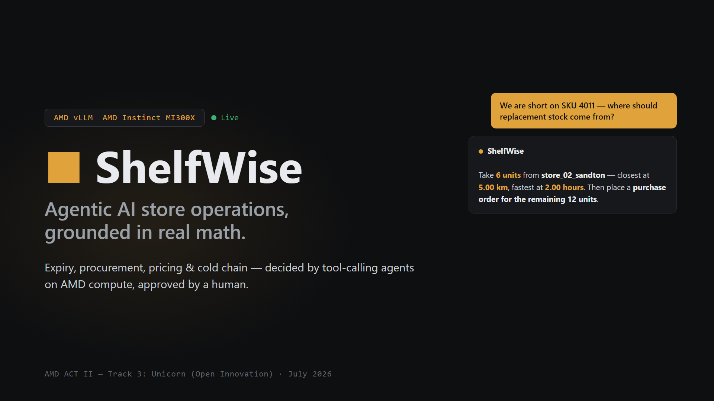

# ShelfWise

[](https://github.com/mrlucas679/shelfwise/actions/workflows/ci.yml)
[](https://github.com/mrlucas679/shelfwise/actions/workflows/capability-diff.yml)
[](LICENSE)
[](pyproject.toml)
[](#built-on-amd-compute-usage-proof)

**Agentic AI store operations, grounded in real math — built on AMD Instinct MI300X.**

AMD Developer Hackathon ACT II · Track 3: Unicorn (Open Innovation).



ShelfWise runs a supermarket's interlocking daily decisions — expiry markdowns, procurement
and multi-source stock sourcing, till-price integrity, cold-chain response, recall quarantine,
and inventory exceptions — through real Critic/Executive agent pairs powered by
**google/gemma-4-E4B-it served on an AMD Instinct MI300X GPU via vLLM 0.23 (ROCm)**. Agents
reason through a bounded tool-calling loop over read-only platform tools, and every
recommendation lands as a pending decision that a human must approve before any write-back
happens.

`event -> agents (Gemma on MI300X) -> tools -> evidence -> critic -> executive -> HITL -> learning`

## Table of Contents

- [Highlights](#highlights)
- [Built on AMD (compute-usage proof)](#built-on-amd-compute-usage-proof)
- [Architecture](#architecture)
- [Tech Stack](#tech-stack)
- [Getting Started](#getting-started)
- [Usage](#usage)
- [Testing](#testing)
- [API Reference](#api-reference)
- [Demo & Evidence](#demo--evidence)
- [Deployment](#deployment)
- [Project Structure](#project-structure)
- [Current Scope](#current-scope)
- [Inference Strategy](#inference-strategy)
- [Model Training](#gemma-4-multimodal-training-harness)
- [Contributing](#contributing)
- [License](#license)

## Highlights

- **Grounded reasoning, enforced in code.** A final agent answer must cite the numbers its
  tools actually computed. An answer citing a figure no tool produced is rejected and re-run
  (`assert_conclusion_grounded_in_tool_results`), never shipped — the model uses tools as its
  calculator and cannot invent figures.
- **Agentic chat over the whole store.** One question can trigger multiple live tool calls in
  a single turn (stock, forecasts, deliveries, sourcing, approvals), with structured markdown
  answers, multi-user conversation identity, and server-side tenant isolation.
- **Real multi-source sourcing decisions.** A shortage is never answered with a bare
  "transfer stock": candidate branches, distribution centres, and suppliers are ranked by
  availability, distance, and lead time, the winner is explained, and a purchase order is
  recommended for anything the winner cannot cover.
- **Human-in-the-loop by construction.** Every recommendation is a pending decision with
  evidence attached; nothing writes back without explicit approval, and approvals feed a
  learning loop that adjusts thresholds from real outcomes.
- **Governed exception workflows.** Recall quarantine, returns, damage, shrink investigation,
  and misplaced-stock relocation each carry required evidence, distinct actions, Critic
  review, and HITL — runnable as seeded drills from the Operations workspace.
- **Receipts, not promises.** A 15-minute live soak harness, committed run artifacts, a
  machine-verified capability manifest that fails CI on drift, and honest evidence reports
  that separate measured behavior from configured behavior.

## Built on AMD (compute-usage proof)

- All agent reasoning — the four agentic cascades (`POST /demo/{golden,procurement,sales,cold-chain}/agentic`)
  and the agentic `/chat` — executes on an **AMD Instinct MI300X** droplet (AMD Developer
  Cloud) running **vLLM 0.23 on ROCm** with native Gemma tool calling
  (`--enable-auto-tool-choice --tool-call-parser gemma4`).
- Live responses carry verifiable headers: `x-shelfwise-provider: vllm_mi300x`,
  `x-shelfwise-model: google/gemma-4-E4B-it`, `x-shelfwise-answer-source: model`.
- A 15-minute continuous soak against the live MI300X endpoint (artifacts under `reports/`)
  finished with **333/333 chat calls genuinely model-backed (zero offline fallbacks, zero
  errors), 4,618 decisions with zero ID collisions, 2,990 HITL approve/reject cycles with
  zero mismatches** — the harness hard-fails a `live_required` run on any offline answer.
- The soak was sequential product validation, not a concurrent inference-capacity benchmark.
  See the [submission evidence report](reports/SUBMISSION_EVIDENCE_REPORT.md) for measured values,
  missing telemetry, and the deployment recommendation.
- Agentic endpoints default to `live_required`: if the MI300X endpoint is unreachable they
  return 503 instead of silently faking success.

Submission assets (slide deck PDF and cover image) are in [`submission/`](submission/).
The [original problem coverage audit](reports/ORIGINAL_PROBLEM_COVERAGE.md) distinguishes proven,
partial, and missing retailer workflows.

## Architecture

| Layer | What it does |
|---|---|
| **Event intake** | POS sales, stock updates, scans, sensor alerts, and connector webhooks (Square/Shopify-style) land on one event bus with provenance and quarantine. |
| **Agent cascades** | Critic/Executive Gemma agent pairs run a bounded tool-calling loop per scenario (golden expiry, procurement, sales price integrity, cold chain) — `live_required` by default. |
| **Platform tools** | Read-only, audited tools: stock, demand forecast, expiry risk, reorder policy, supplier ranking, stock sourcing, cold-chain risk, price integrity, markdown simulation, open decisions, decision explanation, learned thresholds. |
| **Decision & HITL** | Every recommendation becomes a pending decision with evidence objects; approve/reject transitions are audited and tenant-scoped. |
| **Learning loop** | Approved outcomes move thresholds; movements are visible and receipt-backed. |
| **Write-back** | Approved actions queue as task-style write-back receipts (read-only/pending-write posture toward source systems). |
| **Console** | Chat-first React UI: agentic chat, bounded attention sidebar, approval queue, workspaces for products, deliveries, operations, and exception drills. |

All arithmetic lives in tested Python decision-science tools — never hidden inside prompts.

## Tech Stack

- **Inference:** AMD Instinct MI300X (AMD Developer Cloud) · vLLM 0.23 on ROCm · google/gemma-4-E4B-it with native tool calling
- **Backend:** Python 3.11+ · FastAPI · Pydantic · custom decision-science layer (reorder policy, demand forecasting, expiry & cold-chain risk, markdown simulation, sourcing optimisation, robust anomaly detection)
- **Frontend:** React 19 · TypeScript · Vite · react-markdown
- **Quality:** pytest (400+ tests) · ruff · GitHub Actions CI · committed capability manifest with drift-failing contract tests

## Getting Started

### Prerequisites

- Python 3.11+
- Node.js 18+ (frontend)
- Optional for live inference: an OpenAI-compatible vLLM endpoint serving
  `google/gemma-4-E4B-it` with `--enable-auto-tool-choice --tool-call-parser gemma4`

### Installation

```powershell
git clone https://github.com/mrlucas679/shelfwise.git
cd shelfwise
python -m pip install -e ".[dev]"
```

### Configuration (live inference)

Everything runs offline-deterministic with no configuration. To exercise the real model path,
set the endpoint before starting the backend (PowerShell shown; a gitignored `.env` works too):

```powershell
$env:LLM_BASE_URL="http://<your-vllm-endpoint>:8000"
$env:LLM_ROUTINE_MODEL="google/gemma-4-E4B-it"
$env:LLM_STRONG_MODEL="google/gemma-4-E4B-it"
```

See [Inference Strategy](#inference-strategy) for independent routine/strong tier variables.

### Run

```powershell
$env:PYTHONPATH="src"
python -m pytest -q                                   # verify the checkout
python -m uvicorn shelfwise_backend.app:app --host 127.0.0.1 --port 8000
```

In another terminal:

```powershell
cd frontend
npm install
npm run dev -- --host 127.0.0.1 --port 5173
```

Open `http://127.0.0.1:5173` — the health probe is `GET http://localhost:8000/health` and
submission readiness is `GET http://localhost:8000/submission/readiness`.

## Usage

Ask the chat anything about the store — it picks its own tools per question:

> *"Give me a full report: approvals, stock, deliveries, cold chain, and where replacement
> stock should come from."*
> → 4+ live tool calls in one turn; structured report with headings, bullets, and bolded figures.

> *"We are short on SKU 4011. Where should the replacement stock come from?"*
> → ranks branches/DC/suppliers, names the winner and why, flags a purchase order for the rest.

Fire a full agentic cascade directly (`live_required` — 503s rather than faking success):

```bash
curl -X POST http://localhost:8000/demo/procurement/agentic
```

Verify any chat answer is genuinely live from the response headers:
`x-shelfwise-provider: vllm_mi300x` · `x-shelfwise-model: google/gemma-4-E4B-it` ·
`x-shelfwise-answer-source: model`.

In the UI: the approval queue drives HITL approve/reject; the Operations workspace exposes the
four "(agentic) — click to run live" rows and the seeded recall/exception drills.

## Testing

```powershell
$env:PYTHONPATH="src"
python -m ruff check src tests scripts
python -m pytest -q
```

The committed capability manifest ([`capabilities/manifest.json`](capabilities/manifest.json))
is a machine-enforced inventory of routes, tools, and tests — CI fails when reality drifts from
it. Regenerate after any route/tool change with
`python scripts/compare_capability_manifests.py --write`.

A 15-minute full-system soak against the live endpoint:

```powershell
python -m shelfwise_eval.full_system --duration-seconds 900 --live-required --output-dir reports/soak
```

## Test everything in one notebook (GPU / remote Jupyter)

[`notebooks/01_shelfwise_full_test_harness.ipynb`](notebooks/01_shelfwise_full_test_harness.ipynb)
is a self-contained test harness — clone the repo, open the notebook, **Run All**, done. No
extra setup, no data to add: the seed CSVs, dependency lists, and full `src/` tree are all
already in this repo. It installs the project, runs lint, the full test suite, the golden-
scenario eval gate, an in-process API smoke test, and a real `uvicorn` server smoke test on an
actual port — and ends with one summary table so a failure anywhere is impossible to miss. An
optional last section exercises a real inference call through an AMD MI300X/vLLM (or Fireworks)
endpoint if `LLM_BASE_URL`/`LLM_API_KEY` are set in the environment first; everything else runs
fully offline/deterministic.

## API Reference

Interactive OpenAPI docs are served at `http://localhost:8000/docs` when the backend is running.

Connected API endpoints:

- `GET http://localhost:8000/catalog/products/{product_id}`
- `GET http://localhost:8000/catalog/resolve`
- `GET http://localhost:8000/cold-chain/feed`
- `GET http://localhost:8000/connectors/inbound-records`
- `GET http://localhost:8000/connectors/me`
- `GET http://localhost:8000/connectors/systems`
- `GET http://localhost:8000/chat/conversations/{conversation_id}`
- `GET http://localhost:8000/chat/conversations`
- `GET http://localhost:8000/data/seed/summary`
- `GET http://localhost:8000/decisions/{decision_id}`
- `GET http://localhost:8000/decisions`
- `GET/POST http://localhost:8000/demo/critic-rejection`
- `POST http://localhost:8000/demo/golden/agentic`
- `POST http://localhost:8000/demo/procurement/agentic`
- `POST http://localhost:8000/demo/sales/agentic`
- `POST http://localhost:8000/demo/cold-chain/agentic`
- `GET http://localhost:8000/demo/worldgen-runs/{run_id}`
- `GET http://localhost:8000/demo/worldgen-runs`
- `GET http://localhost:8000/demo/worldgen/{scenario_id}`
- `GET http://localhost:8000/detective/root-cause-sql`
- `GET http://localhost:8000/detective/root-cause/{target_id}`
- `GET http://localhost:8000/events/bus`
- `GET http://localhost:8000/events`
- `GET http://localhost:8000/health`
- `GET http://localhost:8000/inference/config`
- `GET http://localhost:8000/inference/readiness`
- `GET http://localhost:8000/inference/smoke`
- `GET http://localhost:8000/learning`
- `GET http://localhost:8000/mlops/accountability`
- `GET http://localhost:8000/mlops/model-runs`
- `GET http://localhost:8000/mlops/observability`
- `GET http://localhost:8000/mlops/prompts`
- `GET http://localhost:8000/mlops/tenant-facts`
- `GET http://localhost:8000/products/attention`
- `GET http://localhost:8000/products/search`
- `GET http://localhost:8000/readiness`
- `GET http://localhost:8000/submission/readiness`
- `GET http://localhost:8000/tools/platform/audit`
- `GET http://localhost:8000/tools/platform`
- `GET http://localhost:8000/trace/{correlation_id}`
- `GET http://localhost:8000/traces`
- `GET http://localhost:8000/worker/runs`
- `GET http://localhost:8000/worker/status`
- `GET http://localhost:8000/writeback/tasks`
- `GET/POST http://localhost:8000/catalog/products/{product_id}/variants`
- `GET/POST http://localhost:8000/catalog/products`
- `GET/POST http://localhost:8000/demo/cold-chain`
- `GET/POST http://localhost:8000/demo/golden`
- `GET/POST http://localhost:8000/demo/procurement`
- `GET/POST http://localhost:8000/demo/sales`
- `GET/POST http://localhost:8000/inventory/positions`
- `GET/POST http://localhost:8000/tenants/me`
- `POST http://localhost:8000/auth/session`
- `POST http://localhost:8000/catalog/identifiers`
- `POST http://localhost:8000/chat`
- `POST http://localhost:8000/connectors/{system}/intake`
- `POST http://localhost:8000/decisions/{decision_id}/approve`
- `POST http://localhost:8000/decisions/{decision_id}/reject`
- `POST http://localhost:8000/demo/recall`
- `POST http://localhost:8000/demo/inventory-exception`
- `POST http://localhost:8000/ingest`
- `POST http://localhost:8000/intelligence/deliveries/reconcile`
- `POST http://localhost:8000/intelligence/outcomes/summarize`
- `POST http://localhost:8000/intelligence/stock/fefo-split`
- `POST http://localhost:8000/intelligence/suppliers/cover-plan`
- `POST http://localhost:8000/mlops/consolidate-memory`
- `POST http://localhost:8000/scan/barcode`
- `POST http://localhost:8000/scan/image`
- `POST http://localhost:8000/scan/receipt`
- `POST http://localhost:8000/voice/in`
- `POST http://localhost:8000/voice/out`
- `POST http://localhost:8000/worker/process-one`
- `POST http://localhost:8000/writeback/tasks/{task_id}/complete`

## Smoke

```powershell
./scripts/smoke.ps1
```

## Demo & Evidence

- [DEMO_RUNBOOK.md](DEMO_RUNBOOK.md) — demo flow, judge story, droplet restart runbook, and cloud proof checks.
- [Submission evidence report](reports/SUBMISSION_EVIDENCE_REPORT.md) — measured behavior vs. configured behavior, honestly separated.
- [Original retailer-problem coverage audit](reports/ORIGINAL_PROBLEM_COVERAGE.md) — per-problem status; partial is never presented as solved.
- [Soak receipts](reports/soak_15min_20260711T042648Z/summary.json) — the 15-minute live run's verdict, totals, and artifact hashes.
- [Slide deck & cover image](submission/) — the hackathon submission assets.

## Deployment

```bash
docker compose up --build
```

The production Nginx image proxies frontend and API traffic through one origin. With the supplied
Compose mapping, open `http://<host>:5173`; judge browsers never call their own localhost. A custom
backend can still be selected at build time with `VITE_API_BASE`.

## Project Structure

```
src/
  shelfwise_backend/           FastAPI app: cascades, HITL, chat, connectors, workers, security
  shelfwise_inference/         OpenAI-compatible client, agent orchestrator, grounding checks
  shelfwise_decision_science/  Reorder policy, forecasting, risk scoring, sourcing, simulation
  shelfwise_contracts/         Money/evidence/decision/event contracts
  shelfwise_data/              Seeded SA retail datasets + store intelligence
  shelfwise_eval/              Eval gates, agent-role coverage, full-system world soak
  shelfwise_benchmark/         Inference architecture benchmark harness
  shelfwise_worldgen/          World simulation and scenario generation
  shelfwise/training/          Gemma 4 multimodal LoRA training harness
frontend/                      React/Vite chat-first operations console
tests/                         400+ tests: contracts, cascades, security, agentic paths
capabilities/                  Machine-verified capability manifest (CI-enforced)
reports/                       Committed evidence: soak receipts, audits, evidence report
data/datasets/                 CSV seed data (products, stock, sales, suppliers)
```

## Current Scope

Built now:

- Money/source/evidence/decision contracts.
- Deterministic decision-science tools.
- Store-intelligence tools for FEFO batch splits, delivery reconciliation, supplier cover, and
  outcome learning, exposed as executable API endpoints.
- Product attention and search endpoints that keep the sidebar bounded while allowing product and
  lot drill-down in the app.
- Runnable local eval harness via `python -m shelfwise_eval`.
- CSV-backed SA retail seed data under `data/datasets`, with validation and a loaded golden
  scenario consumed by the cascade.
- Golden cascade runner.
- Visible Critic rejection cascade that downgrades an unsupported supplier-switch claim to monitor.
- Procurement, sales, and cold-chain cascades with math-backed evidence and HITL policy.
- Supplier recall notices routed through lot-specific stop-sale/quarantine evidence, Critic review,
  HITL approval, and task-only write-back; the seeded drill is runnable from Operations.
- Type-specific inventory exception workflows for returns, damaged stock, shrink discrepancies, and
  misplaced stock, each with required evidence, distinct actions, HITL, world-sim receipts, and UI.
- FastAPI health and demo endpoints.
- Event ingest, event log, trace log, detective root-cause, and worker processing endpoints.
- Product attention and search-first catalogue endpoints that keep the sidebar bounded, use a
  bounded synthetic scan budget for demo catalogue search, and push product/lot exploration into
  the workspace.
- HITL approve/reject endpoints.
- Memory and Postgres store backends with tenant-scoped RLS schema for business tables.
- Learning store that records approved outcomes, task-style write-back receipts, visible threshold
  adjustments, and governed tenant facts.
- Connector provenance layer with quarantine, per-system mappers, inbound record persistence, and
  read-only/pending-write posture.
- MLOps run/prompt registries, accountability reporting, observability snapshot, eval gate, and
  dormant fine-tune export path.
- Worker journal, plan validation, schedule overlap protection, and queue-backed cascade processing.
- Synthetic/worldgen and cold-chain resilience backends.
- Voice and scan backend routes with review-required candidates and upload sniffing.
- Security gateway for prompt fencing, rate limiting, API-key/JWT role gates, and app-level request
  body limits.
- Offline-safe OpenAI-compatible inference gateway for vLLM (any OpenAI-compatible endpoint works).
- Four genuinely agentic cascades (golden, procurement, sales, cold-chain) running Critic/Executive
  verdicts through a real Gemma tool-calling loop on MI300X, `live_required` by default, clickable
  from the Operations workspace.
- Enforced calculator grounding: `assert_conclusion_grounded_in_tool_results` rejects any agent
  conclusion that does not cite the real numbers its own tool calls returned.
- Agentic chat over the full platform-tool registry with multi-user conversation identity,
  idempotent replay, server-side tenant isolation, and structured markdown rendering.
- Multi-source stock sourcing decision (`plan_stock_sourcing` + `get_stock_sourcing_options` tool):
  ranks branches/DC/suppliers by availability, distance, and lead time, explains the winner, and
  recommends a purchase order when nothing can cover the shortage.
- Receipt-driven full-system world simulation harness (`python -m shelfwise_eval.full_system`) with
  committed 15-minute live soak artifacts under `reports/`.
- React/Vite chat-first ops console with bounded attention sidebar, product/workflow workspaces,
  selectable product cards with FEFO lot drill-down, one executive answer, numeric proof rail,
  compact agent chain, drill-down evidence, decision log, inference routing, learning note, and
  HITL approval.
- Tests for contracts, cascades, stores, connectors, MLOps, worldgen, multimodal, security,
  product-scale catalogue behavior, eval readiness, and Gemma training data shape.
- Backend and frontend Dockerfiles plus Compose services.
- GitHub Actions CI for backend lint/tests, ShelfWise eval, backend smoke, frontend build, and Compose
  validation.

Next (honest roadmap, not yet built):

- Deploy a genuine second model endpoint so `dual_model_configured` flips true in production,
  not just in tested routing code.
- Concurrent 1/8/32-user MI300X inference benchmark with ROCm/vLLM resource telemetry.
- Live multi-branch inventory feeds behind the sourcing decision (the decision logic is general
  and unit-tested; today's demo network is seeded fixture data).
- Batch/lot-level expiry tracking and fleet-scale (500k+ SKU) scoring.

## Inference Strategy

ShelfWise keeps one OpenAI-compatible inference contract. **The submission runs exclusively on
the AMD Developer Cloud: a direct MI300X/ROCm/vLLM endpoint serving google/gemma-4-E4B-it.**
The contract also accepts any other OpenAI-compatible endpoint (e.g. Fireworks) unchanged, but
no other provider was used for this submission.

Routine agents can use a smaller model. Critic, Executive, and Orchestrator are routed to the stronger
model tier because they review evidence, catch contradictions, and make the final recommendation.
Both tiers currently point at the same MI300X endpoint; the routing layer (`base_url_for_agent`/
`api_key_for_agent`, `dual_model_configured`) is built and tested, so a second endpoint is a
config change, not a code change.

### AMD Developer Cloud / vLLM preflight

Configure routine and strong tiers independently. The common endpoint/key variables remain
supported as a single-model fallback, but submission readiness requires distinct model IDs:

```powershell
$env:LLM_ROUTINE_BASE_URL="http://<routine-endpoint>:8000"
$env:LLM_STRONG_BASE_URL="http://<strong-endpoint>:8000"
$env:LLM_ROUTINE_API_KEY="<routine-key>"
$env:LLM_STRONG_API_KEY="<strong-key>"
$env:LLM_ROUTINE_MODEL="google/gemma-4-E4B-it"
$env:LLM_STRONG_MODEL="google/gemma-4-31B-it"
$env:LLM_TIMEOUT_SECONDS="25"
$env:LLM_COMPUTE_RESOURCE="AMD Developer Cloud"
$env:LLM_ACCELERATOR="AMD Instinct MI300X"
```

Use these proof endpoints before recording or submitting:

```powershell
Invoke-RestMethod http://127.0.0.1:8000/inference/readiness
Invoke-RestMethod http://127.0.0.1:8000/inference/smoke
Invoke-RestMethod http://127.0.0.1:8000/submission/readiness
```

The production Nginx image proxies frontend and API traffic through one origin. With the supplied
Compose mapping, open `http://<host>:5173`; judge browsers never call their own localhost. A custom
backend can still be selected at build time with `VITE_API_BASE`.

## Gemma 4 Multimodal Training Harness

The repo now has a scriptable harness for the Gemma 4 LoRA path that was previously proven mostly
inside notebooks. It keeps `patch_dense` and `embedding_projection` in the LoRA targets so the run
does not silently collapse to text-only adaptation. Audio and video are supported through honest
fallbacks when native processor tensors are unavailable: audio uses transcripts, and video uses
sampled frame metadata.

Install training dependencies on the ROCm notebook host:

```bash
python -m pip install --upgrade pip
python -m pip install -e ".[training]"
pip install torch --index-url https://download.pytorch.org/whl/rocm7.2
```

After pulling the update on the Jupyter GPU server, run the connected smoke path:

```bash
git pull
bash scripts/jupyter_gemma4_check.sh
bash scripts/jupyter_gemma4_bootstrap.sh
```

That script installs the package, runs the harness tests, runs full GPU preflight, then starts a
gated full shakedown. Override the run name without editing files:

```bash
RUN_NAME=shelfwise-mm-full-8h-002 bash scripts/jupyter_gemma4_bootstrap.sh
```

PowerShell local command prefix when the package is not installed in editable mode:

```powershell
$env:PYTHONPATH="src"
```

Preflight only:

```bash
python -m shelfwise.training.preflight --config configs/train_gemma4_multimodal.yaml
```

Smoke train:

```bash
python -m shelfwise.training.train --config configs/train_gemma4_multimodal.yaml --max_steps 20 --run_name smoke-mm
```

Tomorrow 8-hour shakedown:

```bash
python -m shelfwise.training.train --config configs/train_gemma4_multimodal.yaml --run_name gemma4-mm-8h-001
```

Resume by setting `resume_from_checkpoint` in `configs/train_gemma4_multimodal.yaml` to the
checkpoint path under `runs/gemma4-multimodal/<run>/checkpoints/`.

Eval:

```bash
python -m shelfwise.training.evaluate --config configs/train_gemma4_multimodal.yaml --dry-run
```

Adapter export:

```bash
tar -czf /workspace/shelfwise-gemma-final-adapter.tar.gz -C /workspace/checkpoints/shelfwise-gemma final_adapter
```

Serving/plugin check:

```bash
python -m shelfwise.training.serving_check --config configs/train_gemma4_multimodal.yaml --adapter-path shelfwise-gemma-final-adapter/final_adapter --skip-model-load
```

Troubleshooting:

- Missing target modules: preflight fails if `patch_dense` or `embedding_projection` are absent
  unless `allow_missing_multimodal_targets` is explicitly set.
- Processor load failure: update `transformers`; Gemma 4 uses `Gemma4UnifiedProcessor`.
- Token mismatch: serving check validates the adapter tokenizer metadata and special tokens.
- ROCm OOM: keep `max_seq_length: 2048`, batch size `1`, gradient checkpointing on.
- NaN loss: training stops when configured to fail on non-finite loss.
- Missing evidence file: strict dataset mode fails with the exact row and path.
- vLLM adapter load failure: do not claim full serving support until the adapter loads with the
  deployed vLLM/transformers stack.

## Gemma 4 Multimodal Full Shakedown

Use this when the Jupyter GPU server is ready and you want the whole ShelfWise application AI path in
one gated run:

```bash
python -m shelfwise.training.shakedown --config configs/train_gemma4_multimodal.yaml --run_name shelfwise-mm-full-8h-001
```

The command runs:

`preflight -> simulation dataset build -> smoke train -> full train -> eval -> serving check -> final report`

Generate the simulation dataset only through the dry-run path:

```bash
python -m shelfwise.training.shakedown --config configs/train_gemma4_multimodal.yaml --run_name dataset-check --dry-run
```

The simulation builder emits canonical multimodal episodes across supply-chain reasoning,
multimodal evidence interpretation, incident simulation, report/action planning, and structured
tool-call behavior. It covers damaged goods, missing stock, supplier delays, fake POD, warehouse
voice transcripts, screenshots, proof-of-delivery mismatches, product quality failures, inventory
reconciliation, high-risk supplier patterns, safe cases, and ambiguous missing-evidence cases.

Resume from a checkpoint by setting `resume_from_checkpoint` in
`configs/train_gemma4_multimodal.yaml`, then rerun the shakedown command with a new `--run_name`.

Outputs land under `runs/gemma4-multimodal/` with timestamped checkpoints and reports. The quick
check validates dependencies and fixture generation, but only a generated live-model evaluation
and serving probe can mark a deployment ready.

## Contributing

Issues and pull requests are welcome. Before submitting: run `python -m ruff check src tests
scripts` and `python -m pytest -q`, regenerate the capability manifest if you changed routes or
tools, and keep the README's Connected API endpoints list in sync (a test enforces it).

## License

[MIT](LICENSE)
